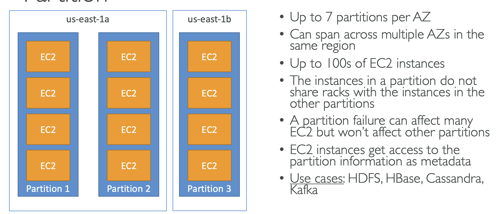
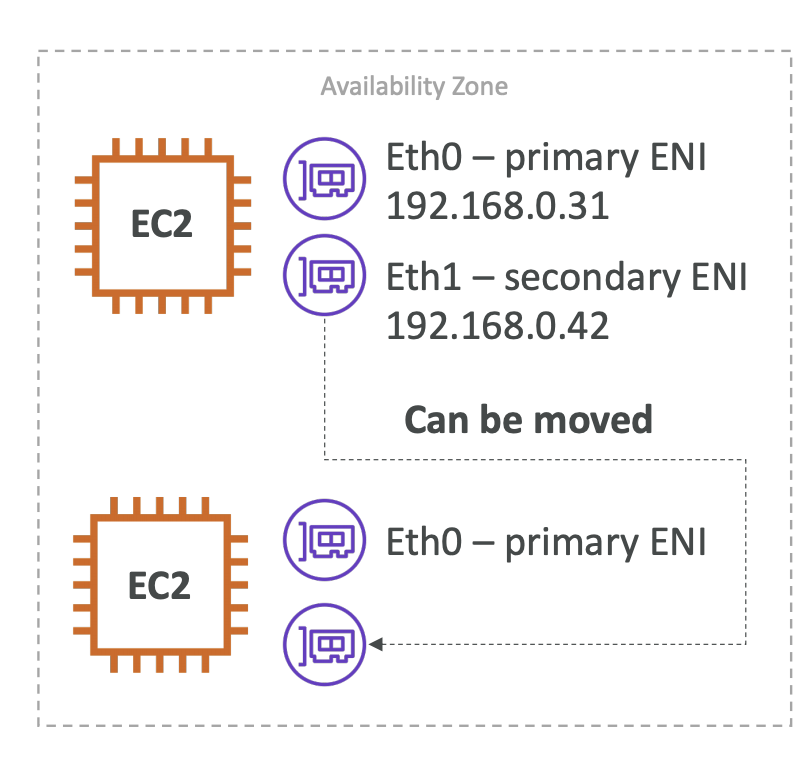
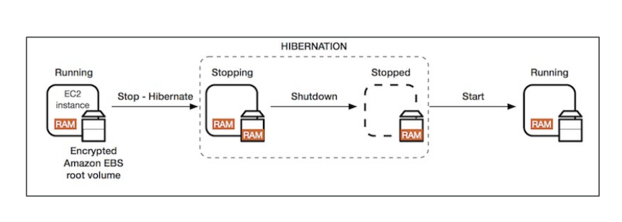

- EC2 user data script runs with the root user.

- Security groups only contain ALLOW rules.

- EC2 instance connect only works out of the box with EC2 Linux 2.

- When you stop and then start an EC2 instance, its public ip can be changed. If you want a fix public IP address, use Elastic IP.

- Elastic IP is a public IP v4 you own as long as you don't delete it.

- Can only have 5 Elatic IP in your account (can increase if you ask AWS).

- You must first cancel Spot Request then terminate spot instances, otherwise Spot Instances will be recreated automatically when you delete them.

- Spot Fleets = Spot instances + (Optional) on-demand instances. Spot fleets allow us to automatically request Spot Instances with the lowest price.

- Strategies to allocate Spot Instances:
    * lowestPrice (from the pool)
    * diversified (across all pools)
    * capacityOptimized (pool with optimal capacity for the number of instances)

- EC2 placement strategies:
    * Cluster: all instances are placed in the same physical server rack in same AZ.
    * Spread: spread instances into multiple AZ and server racks.
    * Partition: spread across AZ, instances are place in a partition.

- Elastic Network Interfaces (ENI) : logical virtual network card.
- you can create ENI independently and attach them on the fly on EC2 instances for failover.

- EC2 hibernate: the RAM state is preserved. Under the hood, RAM state is written to a file in the root EBS volume, the root EBS volume must be encrypted.

## EC2 Nitro
- underlying platform for the next generation of EC2 instances
- New virtualization technology
- 64000 EBS IOPS

- 1 vCPU = 1 thread, 8 vCPU = 4 cores (2 threads per core)
- you can change `# of CPU cores` and `# of threads per core`, disable multithreading for high performance computing (HPC) workloads.

- EBS raid 0 (increase performance): combining 2 or more volumes and getting the total disk space and I/O, but one disk fails, all the data is failed.

- EBS raid 1 (increase fault tolerance): mirroring a volume to another.

- EBS backup use IO and you shoudln't run them while your application is handling a lot of traffic.

- EFS is compatible only with Linux based AMI (not Windows)

