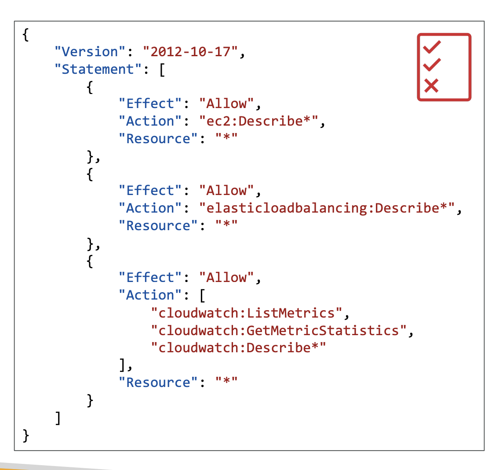
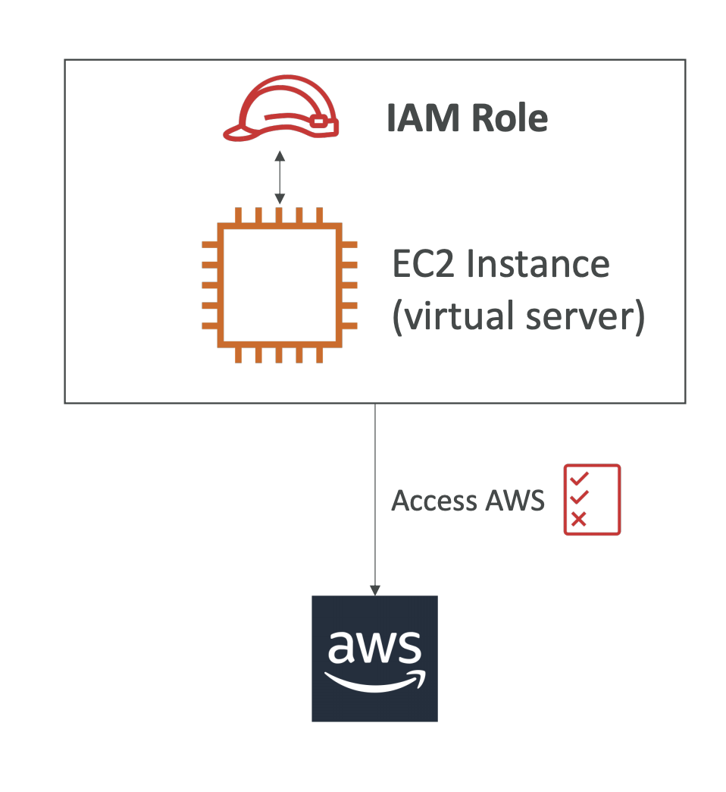

- Group can only contain users, not other groups.

- A user can belong to multiple groups.

- IAM policy (for user or group)

- IAM roles for services

- IAM credentials report (account level)
    * a report that lists all your account's users and the status of their various
credentials

- IAM Access Advisor (user-level)
    * Access advisor shows the service permissions granted to a user and when those
services were last accessed.