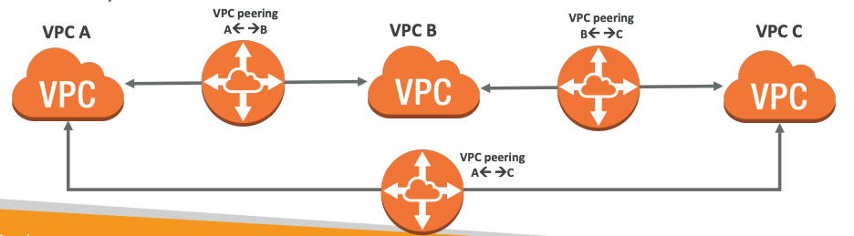
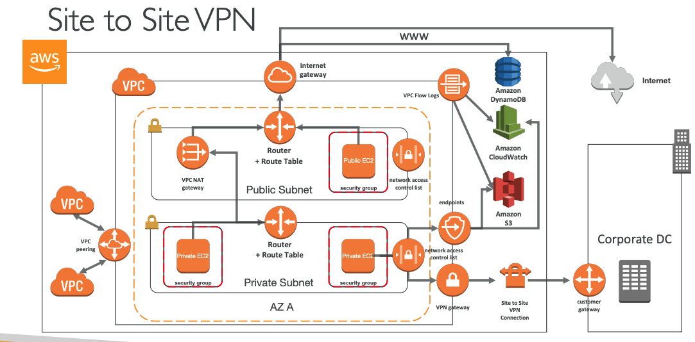
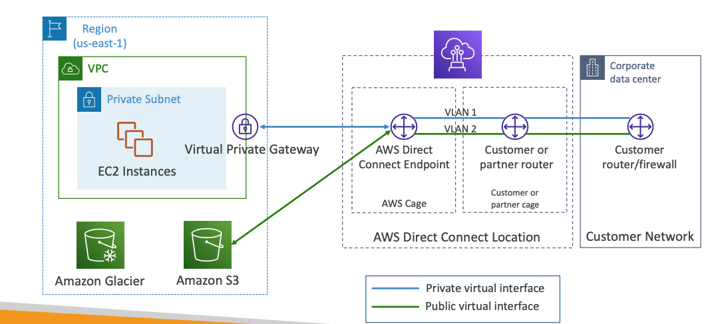
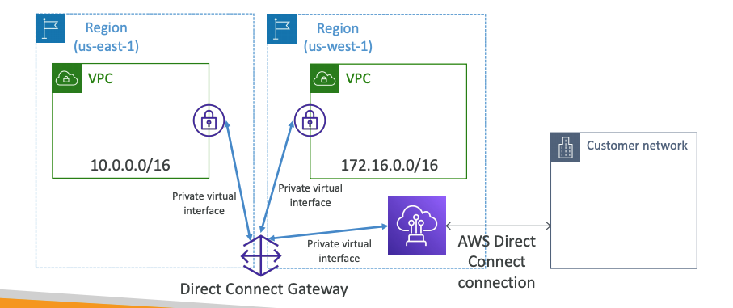
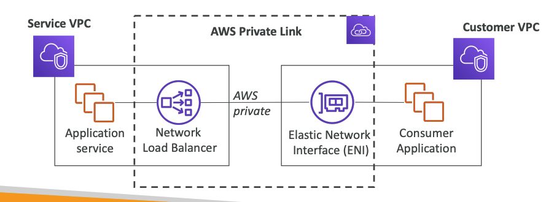
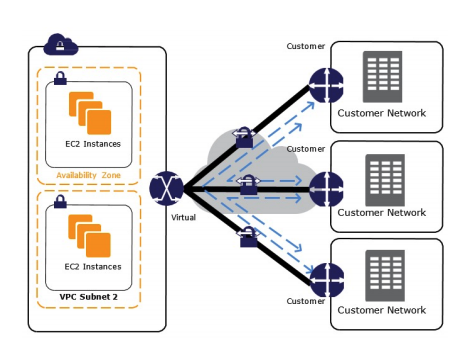
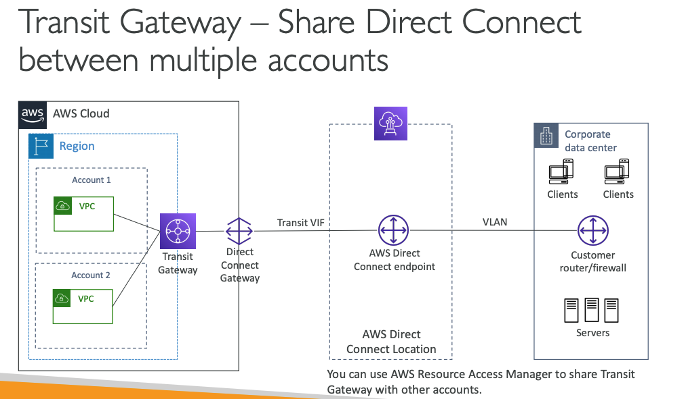

## Understanding CIDR
• A CIDR has two components:
    • The base IP (XX.XX.XX.XX)
    • The Subnet Mask (/26)

- The subnet mask can take two forms:
    - 255.255.255.0 (less common)
    - /24 (more common)

## Private IPV4
- Big network: 10.0.0.0/8
- default AWS: 172.16.0.0/12
- home network: 192.168.0.0/16

## Default VPC
- All new accounts have a default VPC
- New instances are launched into default VPC if no subnet is specified
- Default VPC have internet connectivity and all instances have public IP

- You can have up to 5 VPCs / region

## Subnet - IPv4
- AWS reserves 5 IPs addresses (first 4 and last 1) in each Subnet.

## Internet Gateway
- helps our vpc instances connect with the internet
- *1 vpc can only be attached to 1 IGW and vice versa*
- Internet gateway on their own do not allow internet access
- Route tables must also be edited!

## NAT instances (Network Address Translation)
- Allow instances in the private subnet to connect to the internet
- *Must disable EC2 flag: Source / Destination Check*
- Must have Elastic IP attached to it
- Route table must be configured to route traffic from private subnets to NAT Instance

## NAT Gateway
- AWS managed NAT, higher bandwith, better availability, no admin
- Cannot be used by an instance in that subnet (only from other subnets)
- NAT is created in a specific AZ, uses an EIP

- If you use custom DNS domain names in a private zone in Route 53,
you must set both these attributes to true:
    * enableDnsSupport (DNS Resolution setting)
    * enableDnsHostname (DNS Hostname setting)

## NACL (Network Access Control List)
- One NACL per Subnet, new Subnets are assigned the Default NACL
- Rules have a number (1-32766) and higher precedence with a lower number
- Last rule is an asterisk (*) and denies a request in case of no rule match
- Newly created NACL will deny everything
- Default NACL allows everything outbound and everything inbound

## VPC Pearing
- is not transitive (must be established for each VPC that need to communicate with one another)
- you can do vpc pearing with another AWS account
- you must update route table in each subnet to ensure instances can communicate

## Bastion Hosts
- We can use a Bastion Host to SSH into our private instances
- The bastion is in the public subnet which is then connected to all other private subnets

## Site to Site VPN
• Virtual Private Gateway: VPN concentrator on the AWS side of the VPN connection
• Customer Gateway: Software application or physical device on customer side of the VPN connection

## Direct Connect (DX)

## Direct Connect Gateway
- if you want to set up a direct connect to one or more vpc in many regions , you must use Direct Connect Gateway

- Data in transit is not encrypted but is private

## Egress Only Internet Gateway
- Egress only Internet Gateway is for IPv6 only
- Similar function as a NAT, but a NAT is for IPv4
- IPv6 are all public addresses
- Egress Only Internet Gateway gives our IPv6 instances access to the internet, but they won’t be directly reachable by the internet

## Exposing services in your VPC to other VPC, Private Link

- Most secure & scalable way to expose a service to 1000s of VPC
- Requires a network load balancer (Service VPC) and ENI (Customer VPC)
- If the NLB is in multiple AZ, and the ENI in multiple AZ, the solution is fault tolerant!

- ClassicLink allows you to link EC2-Classic instances to a VPC in your account

## AWS VPN CloudHub 
- Provide secure communication between sites, if you have multiple VPN connections

# Transit Gateway
- For having transitive peering between thousands of VPC and on-premises, hub-and-spoke (star) connection

- Transit Gateway: Site-to-Site VPN ECMP
    * Use case: create multiple Siteto-Site VPN connections to increase the bandwidth of your connection to AWS.

- S3 to CloudFront is free

## IPv6 in VPC
- IPv4 cannot be disabled for your VPC and subnets
- So if you cannot launch an instance in your subnet, It’s not because it cannot acquire an IPv6, It’s because there are no available IPv4 in your subnet