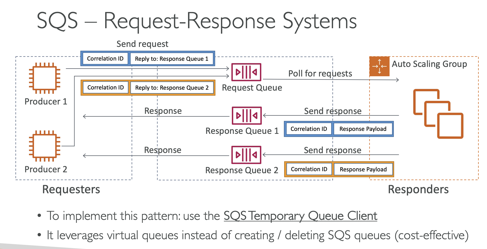
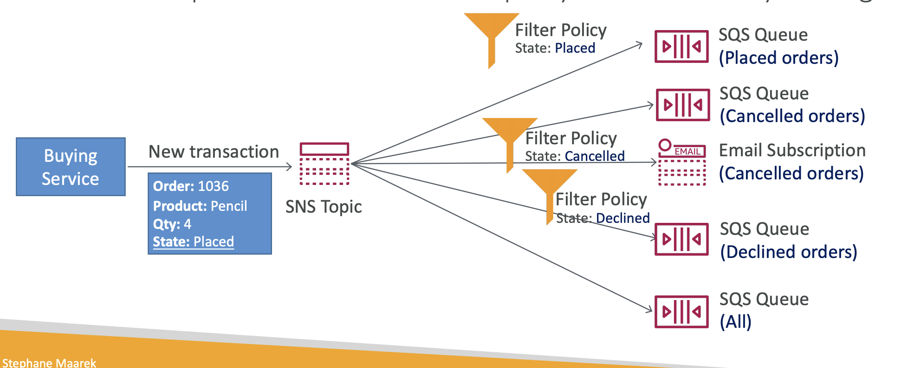

- SQS message retention: 4 to 14 days
- SQS consumers poll up to 10 messages at a time
- by default, message visibility time out is 30 seconds.

- SQS Request response system

- SNS subscription filter policy: if a subscription doesn't have a filter policy, it receives every message.

- Kinesis Data Firehose: does not support replay capacity because it doesn't have data storage, but Kinesis Data Stream does.

- Kinesis Data Strean ordering: Partition key
- SQS: No ordering
- SQS Fifo: Ordering by group id, if there is no group id, messages are consumed in the order they are sent, with only one consumer.