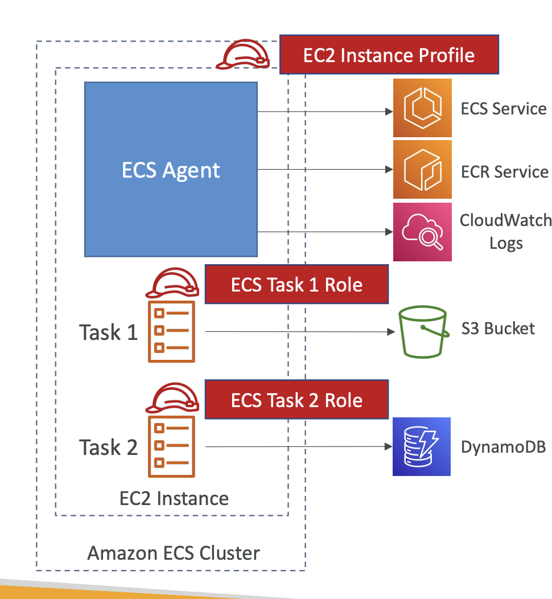
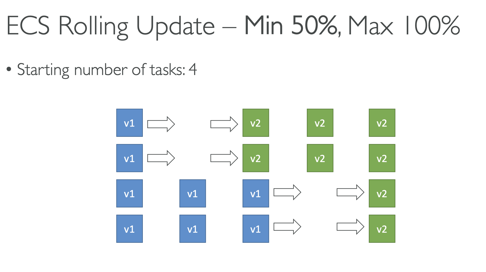
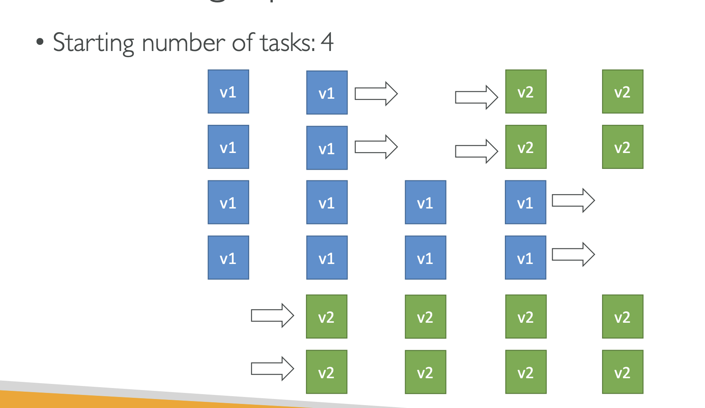

- ECS service -> ECS task (1 container)

- EC2 instance profile used by ECS agent
- EC2 task role: allow each task to have a specific role

## ECS Capacity Provider

## ECS Rolling update

- serverless is a new paradigm in which the developers don't have to manage servers anymore.

- lambda `/tmp`: 512MB
- lambda uncompressed deployment: 250mb
- size of all environment variables: 4KB

- you can use Lambda@Edge to change CloudFront requests and responses

- DynamoDB max size of item 400kb
- SQS max size: 256kb
- you can launch a local DynamoDB on your computer for development purpose

- DynamoDB Global Tables (cross region replication)

- AWS Cognito User Pools (CUP): create a serverless database of user for your mobile app. Can be integrated with API Gateway for authentication

 - Using Cognito to generate temporary credentials with STS to access S3 bucket with restricted policy. App users can directly access AWS resources this way.