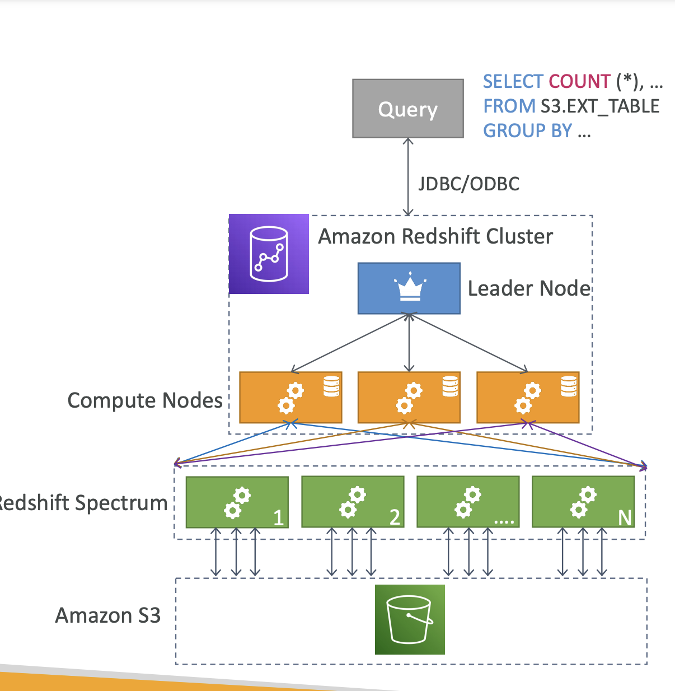

- Aurora Serverless: for unpredictable / intermittent workloads
- Aurora Multi-Master: for continuous writes failover

- OLTP: Online Transaction Processing
- OLAP: Online Analutical Processing

- Redshift has no multi-AZ mode, you can configure to automatically copy snapshots of a cluster to another AWS region.

- Redshift Spectrum: Query data that is already in S3 without loading it.
- Must have a Redshift cluster available to start the query.

## AWS glue
- ETL (extract transform and load)

