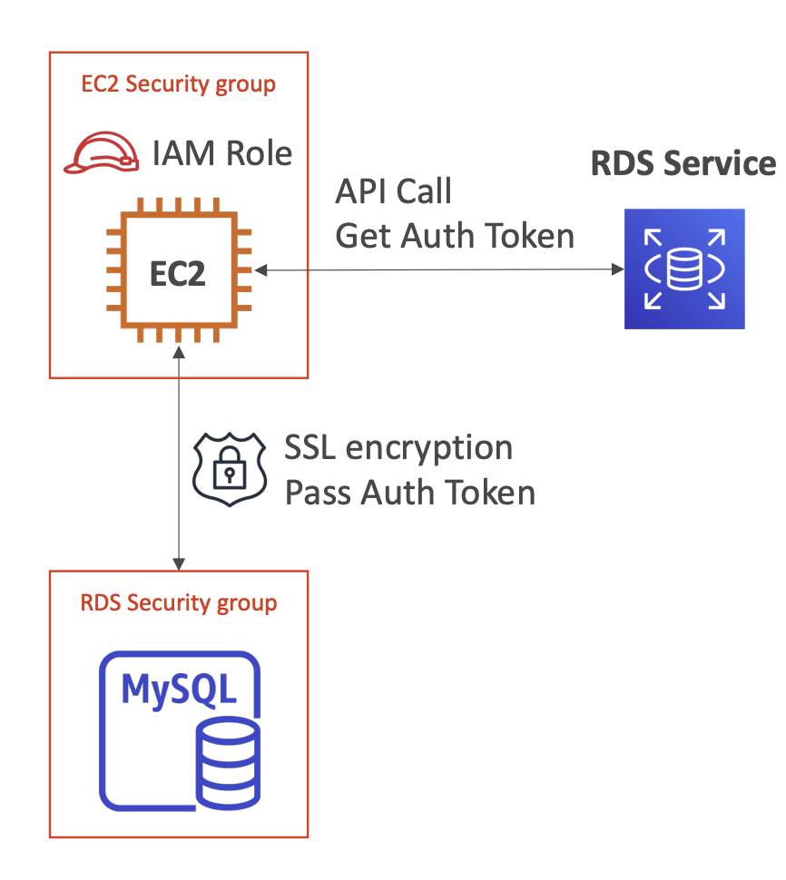
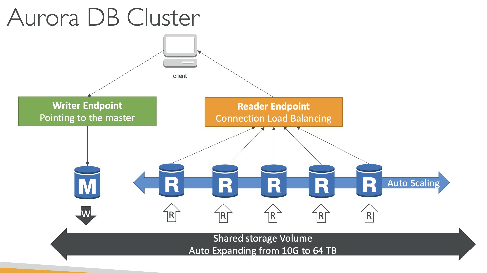
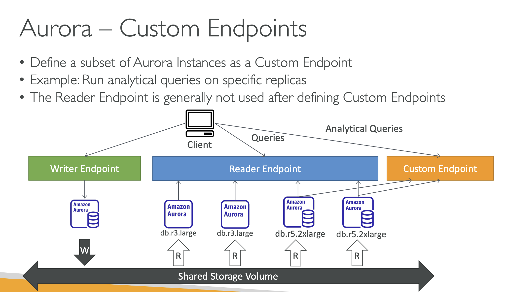

- if the master is not encrypted, the read replicas cannot be encrypted.

- Traditional username and password can be used to login into the database.

- IAM-based authentication can be used to login into RDS MySQL & PostgresSQL.

- Aurora DB Cluster

- Aurora Custom Endpoint

- Aurora global databases

- Aurora machine learning

- Redis Sorted sets guarantee both uniqueness and element ordering