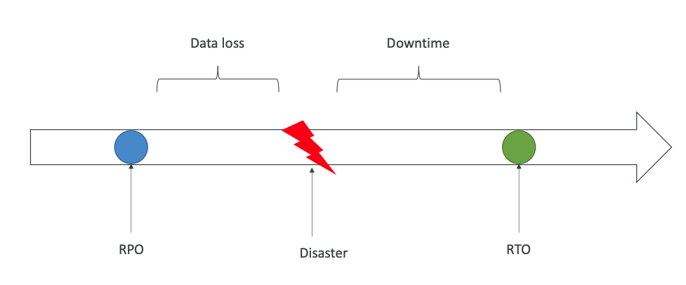
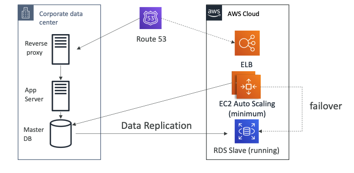
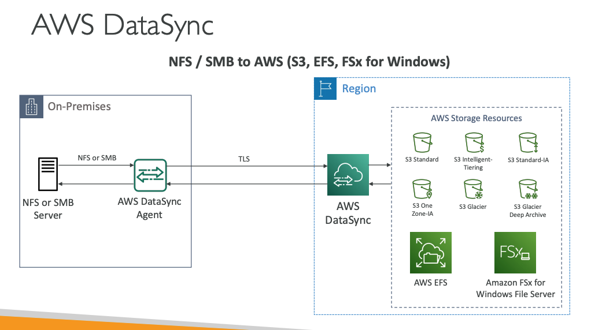
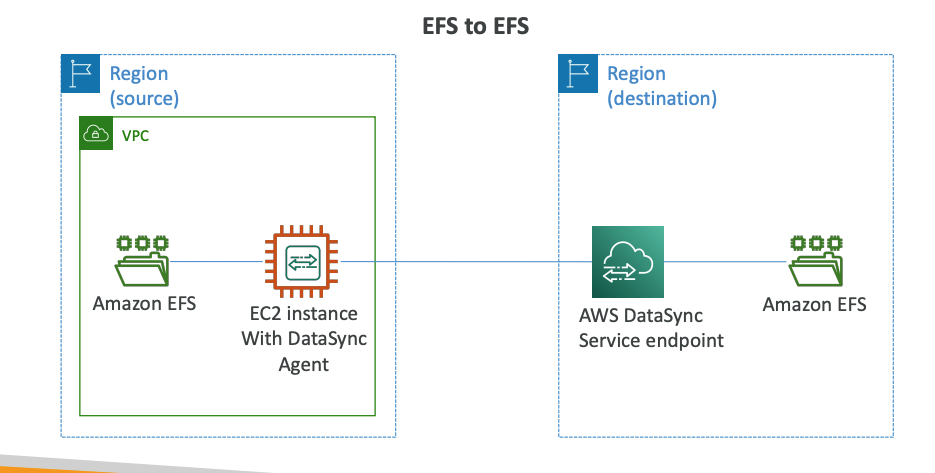
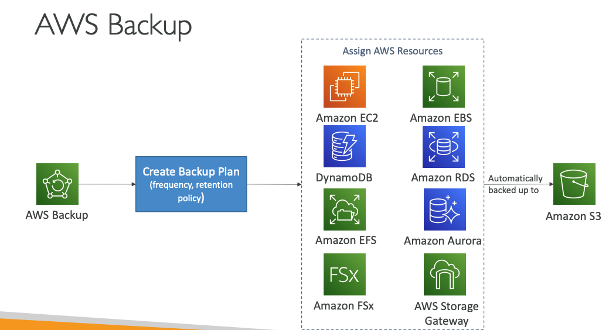

- RPO: Recovery Point Objective
- RTO: Recovery Time Objective

## Disaster recovery strategies

- Backup and Restore

- Pilot light:
    * A small version of the app is always running in the cloud
    * Faster than Backup and Restore as critical systems are already up

- Warm Standby:
    * Full system is up and running, but at minimum size
    * Upon disaster, we can scale to production load

- Hot Site / Multi Site Approach
    * Full Production Scale is running AWS and On Premise

## DMS 
- You must create an EC2 instance to perform the replication tasks

## On-premise strategy with AWS
- AWS Application Discovery Service: Gather information about your on-premise servers to plan a migration
- AWS Server Migration Service (SMS): Incremental replication of on-premise live servers to AWS
- AWS DataSync: Move large amount of data from on-premise to AWS, Amazon S3 (any storage classes – including Glacier), Amazon EFS, Amazon FSx for Windows 

## AWS Backup
- Centrally manage and automate backups across AWS services

- Templates have to be uploaded in S3 and then referenced in CloudFormation

## CloudFormation - StackSets
- Create, update, or delete stacks across multiple accounts and regions with a single operation

## AWS SWF Simple Workflow Service
Step Functions is recommended to be used for new applications, except:
• If you need external signals to intervene in the processes
• If you need child processes that return values to parent processes

## AWS AppSync
- Sync data across mobile and web apps in real-time + GraphQL

## Well Architected Framework
5 Pillars
• 1) Operational Excellence
• 2) Security
• 3) Reliability
• 4) Performance Efficiency
• 5) Cost Optimization

- It’s also questions you need to answer on the AWS Console.

## Operational Excellence
- Perform operations as code
- Annotate documentation
- Make frequent, small, reversible changes -
- Refine operations procedures frequently
- Anticipate failure 
- Learn from all operational failures

## Security
- implement a strong identity foundation
- Enable traceability 
- Apply security at all layers
- Automate security best practices 
- Protect data in transit and at rest
- Keep people away from data
- Prepare for security events

##  Reliability
- Test recovery procedures
- Automatically recover from failure
- Scale horizontally to increase aggregate system availability
- Stop guessing capacity
- Manage change in automation 

## Performance Efficiency
- Democratize advanced technologies
- Go global in minutes
- Use serverless architectures
- Experiment more often
- Mechanical sympathy

## Cost Optimization
- Adopt a consumption mode
- Measure overall efficiency
- Stop spending money on data center operations
- Analyze and attribute expenditure
- Use managed and application level services to reduce cost of ownership

## Trusted Advisor
- Analyze your AWS accounts and provides recommendation
    * Cost Optimization
    * Performance
    * Security
    * Fault Tolerance
    * Service Limits

