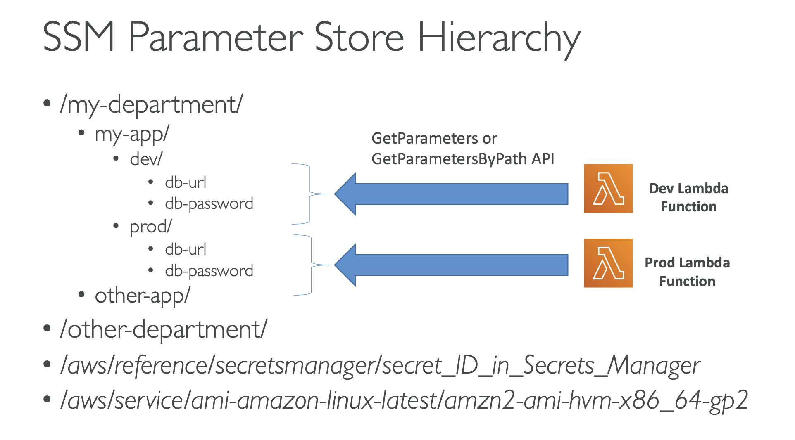

- KMS can only help in encrypting up to 4KB of data per call.
- if data > 4kb, use envelope encryption

- KMS Automatic key rotation
    * if enabled: automatic key rotation happens every 1 year
    * new key has the same CMK ID, only the backing key is changed

- KMS Manual key rotation
    * new key has different CMK ID

## SSM Parameter Store
- Secure storage for configuration and secrets

## AWS Secret Manager
- Newer service, meant for storing secrets

## AWS WAF
- Protects your web application from common web exploits (Layer 7)
- Deploy on ALB, CloudFront, API Gateway

## AWS Firewall Manager

## Amazon GuardDuty
- Intelligent Thread discovery to protect AWS account
• Input data includes: 
    • CloudTrail Logs: unusual API calls, unauthorized deployments 
    • VPC Flow Logs: unusual internal traffic, unusual IP address 
    • DNS Logs: compromised EC2 instances sending encoded data within DNS queries
## Amazon Inspector
- Automated Security Assessments for EC2 instances
- Analyze the running OS against known vulnerabilities
- Analyze against unintended network accessibility

## Amazon Macie
• Amazon Macie is a fully managed data security and data privacy service that uses machine learning and pattern matching to discover and protect your sensitive data in AWS.

- Macie helps identify and alert you to sensitive data, such as personally identifiable information (PII)