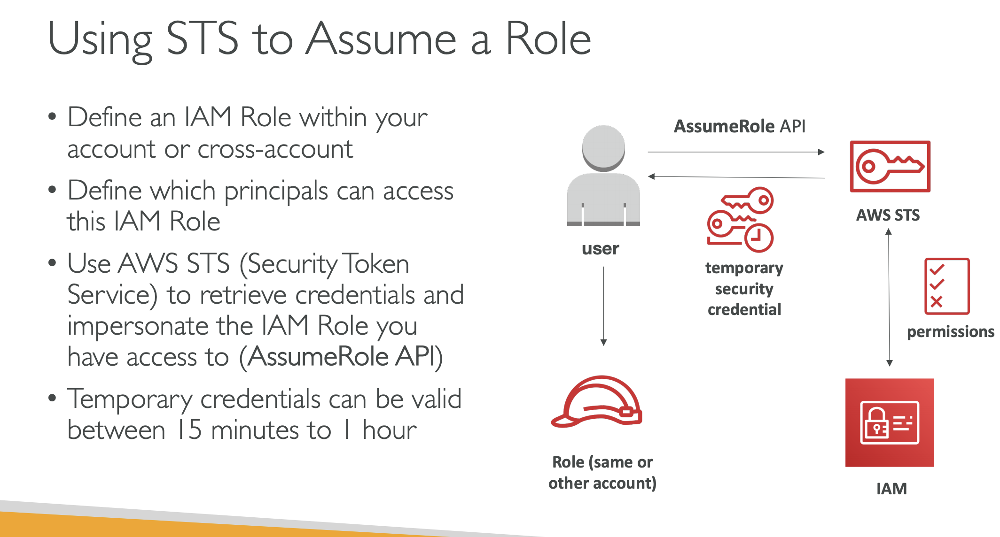
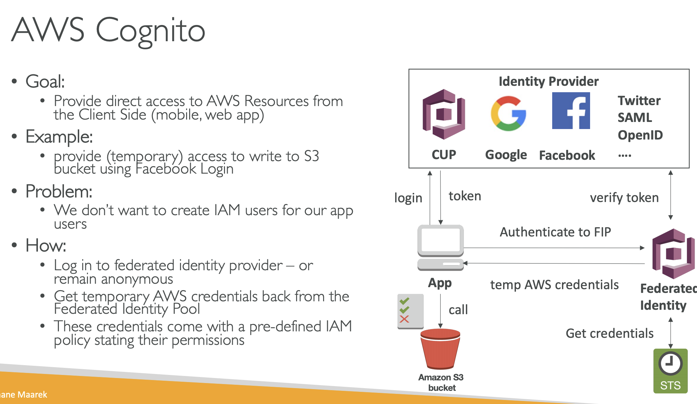
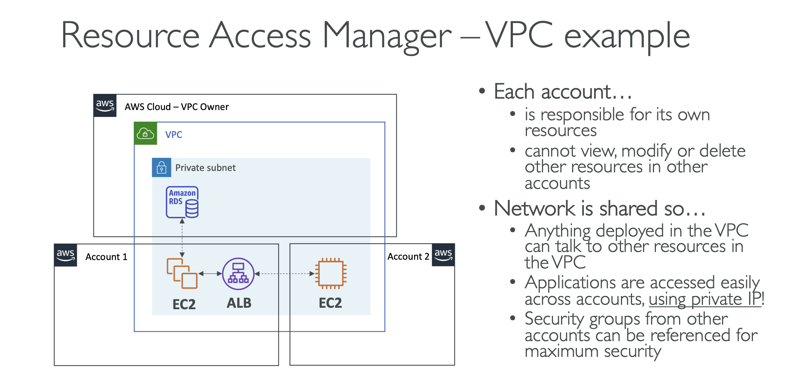

- Dashboards are global
- Dashboards can include graph from different AWS accounts and regions

## AWS CloudWatch Logs
- Log groups: usually representing an application
- Log stream: instances within application / log files / containers
- Encryption logs using KMS at Group level

## EventBridge
- is the next evolution of CloudWatch Events
- Default event bus: generated by AWS services
- Partner event bus: receive events from Saas service or applications
- Custom Event bus: for your own application

- EventBridge can analyze the events in your bus and infer the schema
- The schema registry allow you to generate code for your application, that will known in advance how data is structured in the event bus.

## CloudTrail
- Events are stored for 90 days in CloudTrail

## AWS Config
- Helps record configurations and changes over time.
- region scoped

- Config Rules: AWS Config Rules does not prevent actions from happening.
- AWS Config Resource: View compliance of a resource over time.

## AWS STS - Security Token Service
- Allows to grant limited and temporary access to AWS resources.

## Organization

- Service Control Policies (SCP):
    * whitelist or blacklist IAM actions
    * Applied at the OU or Account level
    * Does not apply to the Master Account
    * SQP must have an explicit Allow (nothing is allowed by default)

- IAM S3, if ends with `/*` => object level permission, otherwise, bucket level permisison.

## IAM Roles vs Resource Based Policies
- When you assume a role, you give up your original permissions and take the permissions assigned to the role.
- When using a resource based policy, the principal doesn't have to give up his permissions.

## AWS Resource Access Manager
- Share AWS resources that you own with other AWS accounts

