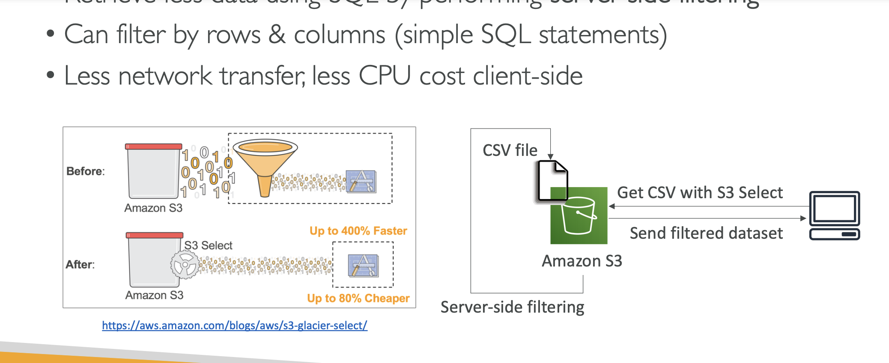
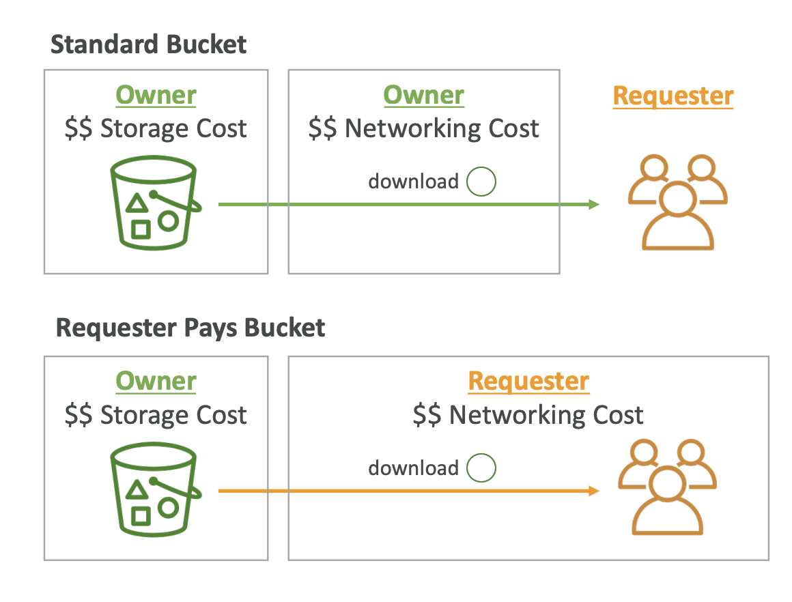
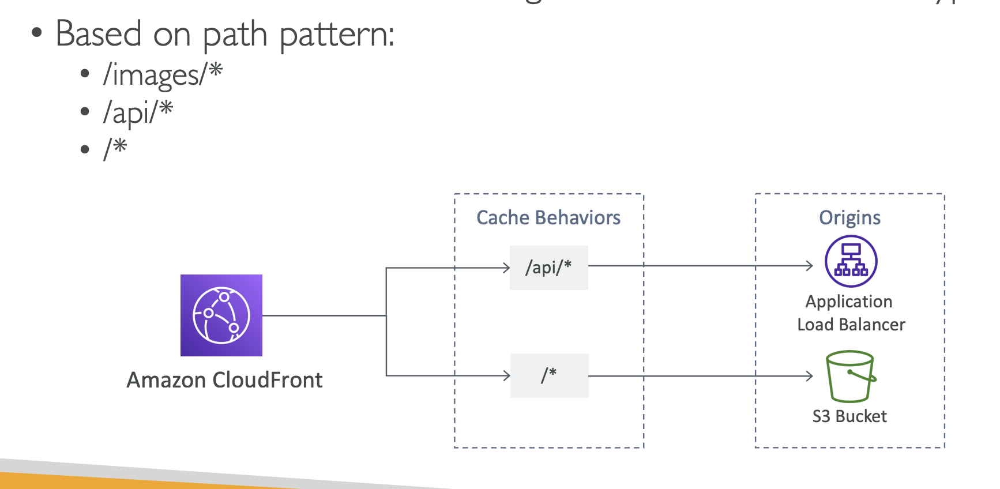

- S3 buckets must have a globally unique name.

- Max size of object is 5TB.
- upload more than 5GB must use "multi-part upload".

- SSE-S3: "x-amz-server-side-encryption":"AES256"
- SSE-KMS: "x-amz-server-side-encryption": "aws:kms"
- SSE-C: must use HTTPS

- To use MFA-delete, enable versioning on the S3 bucket.
- you will need MFA to
    * permanently delete an object version
    * suspend versioning on the bucket

- only the bucket owner, the root account can enable/disable MFA-delete
- MFA delete currently can only be enabled using the CLI
- there is no "chaining" of replication

- S3 lifecycle rules:
    * transition actions
    * expiration actions

- S3 Analytics: you can setup S3 Analytics to help determine when to transition objects from Standard to Standard_IA

- There are no limits to the number of prefixes in a bucket.

- S3 select and Glacier select: retrieve less data using SQL by performing server side fitlering.

- S3 requester pay

- AWS Athena: Serverless service to perform analytics directly against S3 files.

- S3 Object lock: block an object version deletion for a specified amount of time

- CloudFront origin:   
    * S3 bucket: Origin Access Identity (OAI)
    * Custom HTTP origin

- CloudFront Geo Restriction:
    * Whitelist
    * Blacklist

- CloudFront vs S3
    * CF: great for static content that must be available anywhere
    * S3: great for dynamic content that needs to be available at low-latency in few regions

- CloudFront multiple origin

- CloudFront Origin Groups (Failover)
    * one primary and one secondary

- CloudFront field level encryption

- Unicast IP: one server holds one IP addres
- Anycast IP: all servers share the same IP address and the client is routed to the nearest one.

- AWS Global Accerator: leverage the AWS internal network to route to your application.

- Snowmobile is better than Snowball Edge if you transfer more than 10 PB.
- OpsHub: manage your Snow Family Device.
- *Snowball cannot import to Glacier directly*.

- Storage Gateway means you need on-premises virtualization
- Otherwise, you can use a Storage Gateway Hardware Appliance

- File Gateway: NFS - Active Directory
- Volume Gateway: iSCSI
- Tape Gateway: VTL Tape 
- Hardware Appliance: No on-premises virtualization

## AWS Transfer Family
- A fully-managed service for file transfer into and out of Amazon S3 or EFS using FTP protocol.
